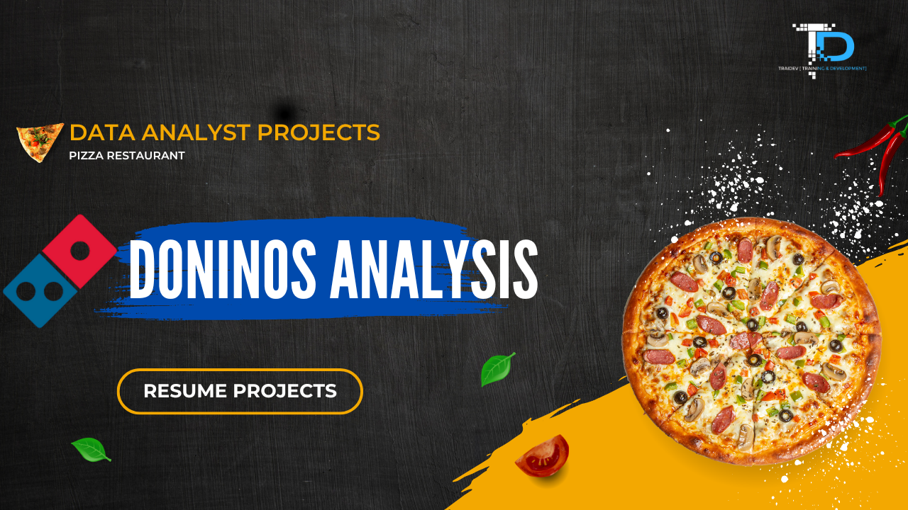

# Domino's Pizza Store Analysis SQL Project

## Project Overview
**Project Title:** Domino's Pizza Store Analysis  
**Level:** Beginner to intermediate  
**Database:** `p1_dominos_db`   

This project demonstrates SQL techniques used by analysts to explore, clean, and analyze pizza sales and customer data. The analysis focuses on understanding order patterns, revenue, customer behavior, and menu performance to support business decision-making.

## Objectives

### 1. Database Setup:
Designed and populated the Domino’s Pizza database, including tables for orders, pizzas, and customers.

### 2. Data Cleaning
Performed data cleaning by handling missing values, removing duplicates, and fixing inconsistencies.

### 3. Exploratory Data Analysis (EDA)
Conducted EDA to analyze customer behavior, order trends, and product performance.

### 4. Business Analysis
Derived business insights by answering stakeholder-driven questions to support data-driven decisions.

# Database Structure

## Tables:

- `orders`: Contains order-level information (order_id, custId, order_date, order_time).
- `order_details`: Contains details of each order (order_detail_id,order_id,pizza_id, quantity).
- `pizzas`: Contains pizza information (pizza_id, pizza_type_id, size, price).
- `pizza_types`: Contains pizza type info (pizza_type_id, name, category).
- `customers`: Contains customer info (custId, first_name, last_name).

# Data Cleaning & Exploration
- Verify total records in each table.
- Check for null or missing values in critical columns.
- Remove incomplete or inconsistent records.

# Analysis & Queries

1. **Orders Volume Analysis**
   - Total unique orders
   - Orders by month
   - Day-of-week analysis
   - Repeat customers
   - Average orders per customer
   - Cumulative order trend

2. **Total Revenue from Pizza Sales**
   - Calculated total revenue generated from all pizza sales

3. **Highest-Priced Pizza**
   - Identified the most expensive pizza on the menu

4. **Most Common Pizza Size Ordered**
   - Determined the most frequently ordered pizza size

5. **Top 5 Most Ordered Pizza Types**
   - Based on total quantity sold

6. **Total Quantity by Pizza Category**
   - Category-wise total pizzas sold

7. **Orders by Hour of the Day**
   - Peak ordering hours analysis

8. **Category-Wise Pizza Distribution**
   - Sales distribution and percentage share by category

9. **Average Pizzas Ordered per Day**
   - Daily demand consistency analysis

10. **Top 3 Pizzas by Revenue**
   - Highest revenue-generating pizzas

11. **Revenue Contribution per Pizza**
   - Percentage contribution of each pizza to total revenue

12. **Cumulative Revenue Over Time**
   - Monthly revenue growth trend

13. **Top 3 Pizzas by Category (Revenue-Based)**
   - Best-performing pizzas in each category

14. **Top 10 Customers by Spending**
   - Highest value customers

15. **Orders by Weekday**
   - Busiest days of the week

16. **Average Order Size**
   - Average number of pizzas per order

17. **Seasonal Trends**
   - Monthly and holiday-based sales patterns

18. **Revenue by Pizza Size**
   - Revenue contribution by size (S, M, L, XL, XXL)

19. **Customer Segmentation**
   - High Value vs Regular customers based on spend

20. **Repeat Customer Rate**
   - Percentage of customers who ordered more than once

# Key Findings
-**Customer Behaviour:** High-value and repeat customers identified.  
-**Order Trends:** Peak hours, weekends, and seasonal patterns discovered.  
-**Menu Insights:** Top-selling pizzas, revenue contributors, and popular sizes identified.  
-**Revenue Analysis:** Monthly revenue, cumulative trends, and category-wise contributions analyzed.  
-**Operational Insights:** Average order size, daily pizzas, and staffing optimization recommendations provided.  

